# Curso de Algoritmos de Clasificación de Texto

- [Curso de Algoritmos de Clasificación de Texto](#curso-de-algoritmos-de-clasificación-de-texto)
  - [Modulo 1 Desambiguacion y etiquetado de palabras](#modulo-1-desambiguacion-y-etiquetado-de-palabras)
    - [Clase 1 Introduccion a la desambiguación](#clase-1-introduccion-a-la-desambiguación)
    - [Clase 2 Etiquetado rápido en Python: español e inglés](#clase-2-etiquetado-rápido-en-python-español-e-inglés)
    - [Clase 3 Etiquetado rapido en Python: Stanza (Stanford NLP)](#clase-3-etiquetado-rapido-en-python-stanza-stanford-nlp)
  - [Modulo 2. Modelos Markovianos Latentes (HMM)](#modulo-2-modelos-markovianos-latentes-hmm)
    - [Clase 4 Cadenas de Markov](#clase-4-cadenas-de-markov)
    - [Clase 5 Modelos Markovianos latentes (HMM)](#clase-5-modelos-markovianos-latentes-hmm)
    - [Clase 6 Entrenando un HMM](#clase-6-entrenando-un-hmm)
    - [Clase 7 Fases de entrenamiento de un HMM](#clase-7-fases-de-entrenamiento-de-un-hmm)
    - [Clase 8 Entrenando un HMM en Python](#clase-8-entrenando-un-hmm-en-python)
  - [Modulo 2 Algoritmo de Viterbi](#modulo-2-algoritmo-de-viterbi)
    - [9 Clase El algoritmo de Viterbi](#9-clase-el-algoritmo-de-viterbi)
    - [Clase 10 Calculo de las probabilidades de Viterbi](#clase-10-calculo-de-las-probabilidades-de-viterbi)
    - [Clase 11 Carga del modelo HMM y distribucion inicial](#clase-11-carga-del-modelo-hmm-y-distribucion-inicial)
    - [Clase 12 Implementacion de algoritmo de Viterbi en Python](#clase-12-implementacion-de-algoritmo-de-viterbi-en-python)
    - [Clase 13 Entrenamiento directo de HMM con NLTK](#clase-13-entrenamiento-directo-de-hmm-con-nltk)
      - [Reto del modulo](#reto-del-modulo)
  - [Modulo 3 Modelos Markovianos de máxima entropía (MEMM)](#modulo-3-modelos-markovianos-de-máxima-entropía-memm)
    - [Clase 14 Modelos Markovianos de maxima entropia (MEMM)](#clase-14-modelos-markovianos-de-maxima-entropia-memm)
      - [Comparacion entre modelos](#comparacion-entre-modelos)
    - [Clase 15 Algoritmo de Viterbi para MEMM](#clase-15-algoritmo-de-viterbi-para-memm)
    - [Clase 16 Reto: construye un MEMM en Python](#clase-16-reto-construye-un-memm-en-python)
  - [Modulo 4 Clasificacion de texto con NLTK](#modulo-4-clasificacion-de-texto-con-nltk)
    - [Clase 17 El problema general de la clasificación de texto](#clase-17-el-problema-general-de-la-clasificación-de-texto)
      - [Tecnicas de Clasificacion](#tecnicas-de-clasificacion)
      - [Clasificacion de palabras](#clasificacion-de-palabras)
      - [Clasificacion de documentos](#clasificacion-de-documentos)
    - [Clase 18 Tareas de clasificacion con NLTK](#clase-18-tareas-de-clasificacion-con-nltk)
      - [Primer Ejercicio](#primer-ejercicio)
      - [Segundo Ejercicio](#segundo-ejercicio)
    - [Clase 19 Modelos de clasificacion en Python: nombres](#clase-19-modelos-de-clasificacion-en-python-nombres)
    - [Clase 20 Modelos de clasificacion en Python: documentos](#clase-20-modelos-de-clasificacion-en-python-documentos)
  - [Modulo 6 Implementacion de un modelo de clasificacion de texto](#modulo-6-implementacion-de-un-modelo-de-clasificacion-de-texto)
    - [Clase 20 Naive Bayes](#clase-20-naive-bayes)
    - [Clase 22 Naive Bayes en Python: preparacion de los datos](#clase-22-naive-bayes-en-python-preparacion-de-los-datos)
    - [Clase 23 Naive Bayes en Python: construcción del modelo](#clase-23-naive-bayes-en-python-construcción-del-modelo)
    - [Clase 24 Naive Bayes en Python: ejecución del modelo](#clase-24-naive-bayes-en-python-ejecución-del-modelo)
    - [Clase 25 Metricas para algoritmos de clasificacion](#clase-25-metricas-para-algoritmos-de-clasificacion)
    - [Clase 26 Reto final: construye un modelo de sentimientos](#clase-26-reto-final-construye-un-modelo-de-sentimientos)

## Modulo 1 Desambiguacion y etiquetado de palabras

### Clase 1 Introduccion a la desambiguación

Este curso utilizaremos machine learning para clasificación de texto.

Ambigüedad del lenguaje: se da porque el lenguaje humano es difuso y necesita mucho contexto.

Ejemplo

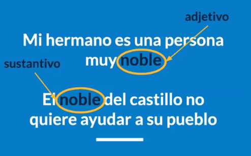

Las ambigüedades del lenguaje pueden ser de muchos tipos.

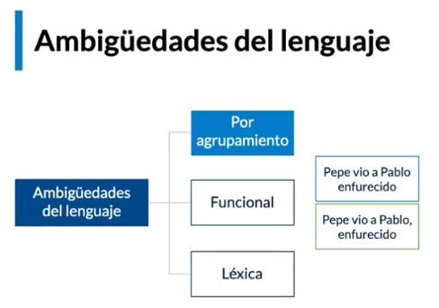

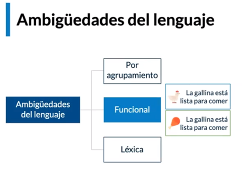

Ese ejemplo no lo podemos atacar en este curso, ya que dependemos de una imagen adicional para obtener contexto.

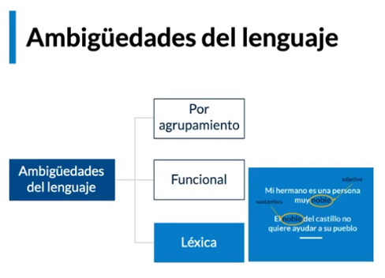

Dependence la categoría gramatical de la palabra (encerrada en el circulo en el ejemplo que puede ser un verbo o un sustantivo)

El primer paso de este curso es utilizar la api de google de ["Natural Language"](https://cloud.google.com/natural-language).

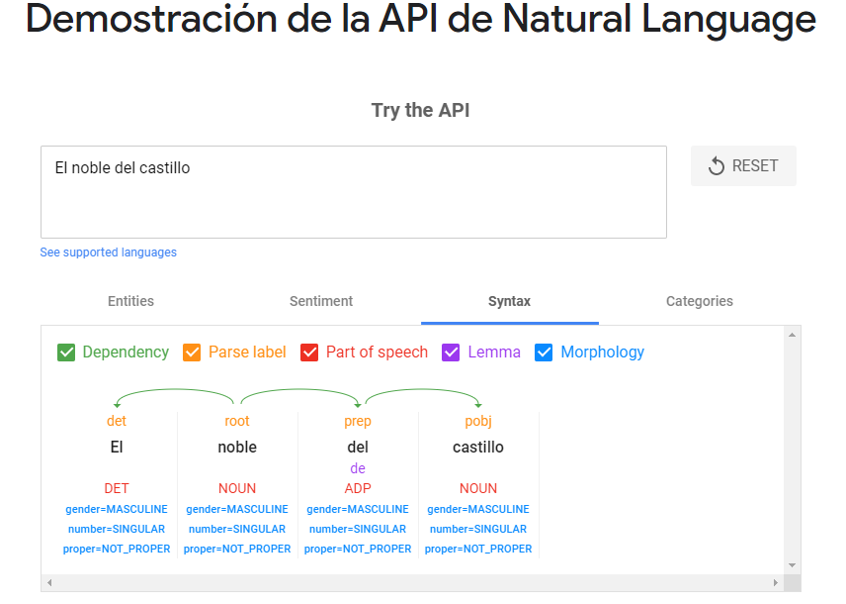

Aplicaciones:

- Mejoras en motores de búsqueda, e-commerce y web.
- Automatización en manejo de CRMs.
- Censura en redes sociales.
- Orden de datos no-estructurados.

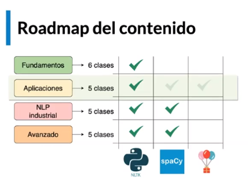

### Clase 2 Etiquetado rápido en Python: español e inglés

En la clase anterior vimos que el problema grande del procesamiento del lenguaje natural es la ambigüedad y se resuelve con clasificación.

Para esta clase utilizaremos [esta plantilla](https://colab.research.google.com/drive/1NvQP7HipzJ0OF0bjkkfzwVUwYVoRoBP8?usp=sharing) en google Collab

Etiquetado en ingles

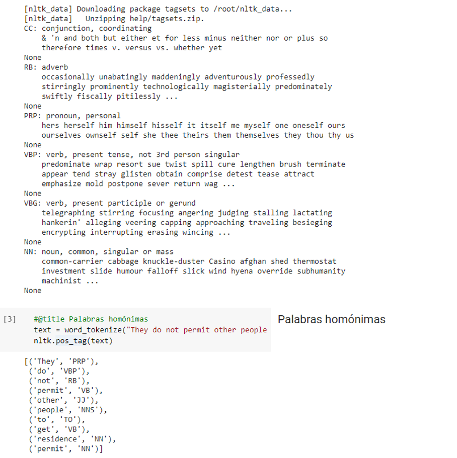

Como observas es sencillo realizar el etiquetado de palabras en ingles puesto que nltk tiene algoritmos pre-entrenados, la historia no es asi en español, por lo que es preciso entrenar nuestro algoritmo previamente.

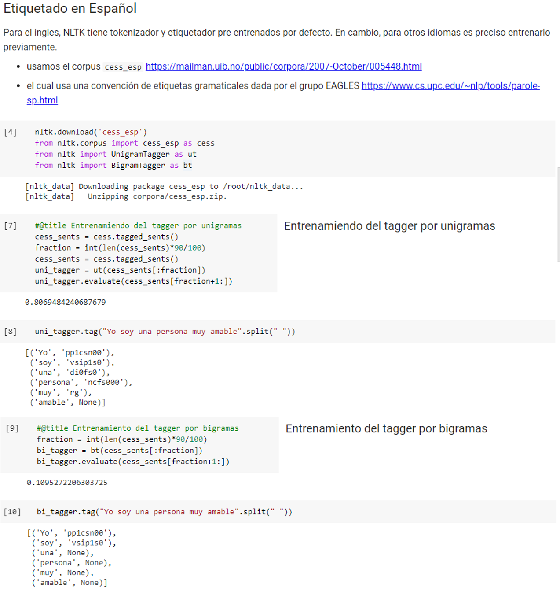

### Clase 3 Etiquetado rapido en Python: Stanza (Stanford NLP)

Stanza es una librería desarrollada por el grupo de investigación de lenguaje natural de la Universidad de Stanford.

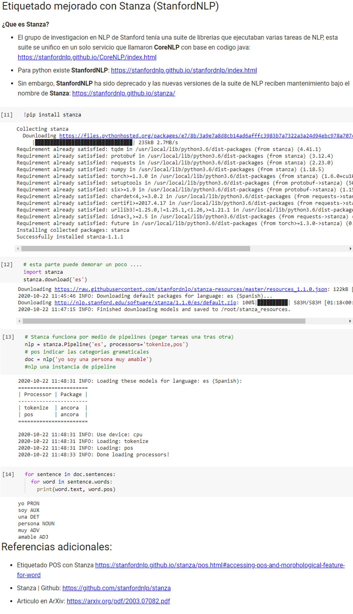

## Modulo 2. Modelos Markovianos Latentes (HMM)

### Clase 4 Cadenas de Markov

En la primer celda de la clase anterior vimos este snippet.


Después de importar nltk  utilizamos 2 paquetes.

punkt: (Palabra alemana que significa puntuación) un tokenizador.

averaged_perceptron: un clasificador, es la base del universo de técnicas de clasificación.

En base a ello podemos definir una escalera de modelos, donde los modelos markovianos latentes serán nuestra base para entender los siguientes.

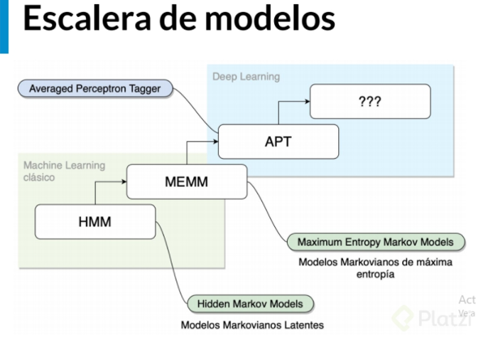

HMM Esta basado en el concepto de cadenas de Markov

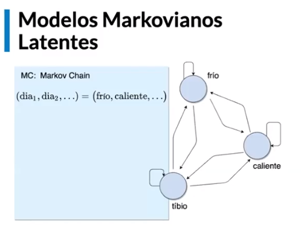

Piensa en un sistema con un conjunto finito de estados (conjunto determinado de categorías que puedes contar, como el clima en un dia).

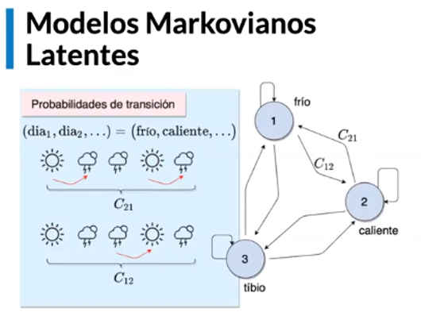

El diagrama mide la probabilidad de que a un dia frio le siga otro dia frio, o que de un dia frio le siga un dia caliente, etc.

Todas las flechas definen una transición, en conjunto definen todas las transiciones.

Una **cadena de Markov** define la **probabilidad de transición** entre los posibles estados que un sistema puede tener.

Haciendo la lógica para las posibles transiciones obtenemos la matriz de transición.

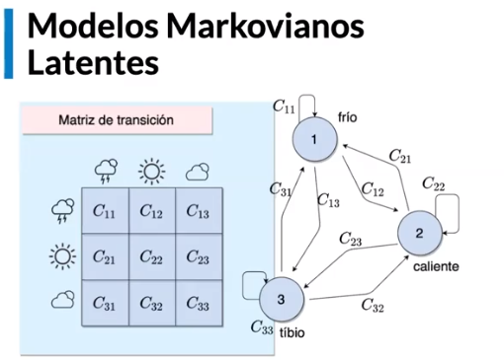

Los números (no los subindices tipo coordenada) serán as probabilidades de transición.

Otro componente importante es la **distribución inicial de estados** (letra PI).

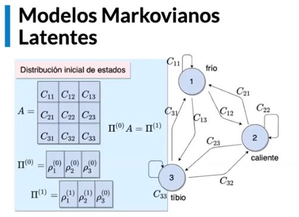

PI tiene 3 componentes, que definen la probabilidad inicial de que un dia sea frio o caliente o tibio.

Lo que sucede es que nosotros multiplicamos nuestra matriz de transición por nuestro estado inicial PI(0), ese resultado nos dará el siguiente vector de estados PI(1). Eso nos indica la manera en que las probabilidades van cambiando a medida que el sistema evoluciona.

### Clase 5 Modelos Markovianos latentes (HMM)

Las cadenas de markov son la base para entender como funcionan los etiquetadores de palabras.

En una cadena de markov tenemos dos ingredientes principales:

- Matriz de transición (cada elemento representa la probabilidad de transición al siguiente estado)

- Distribución de estados

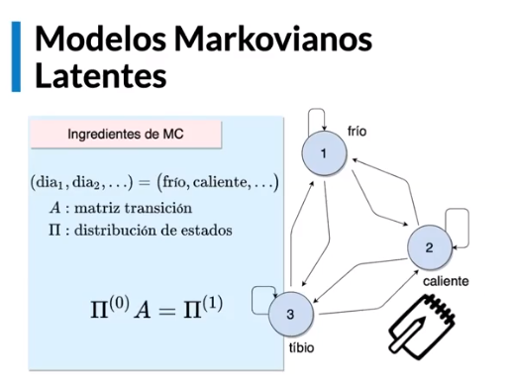

Ejemplo

Consideramos una cadena de Markov donde tenemos 3 estados(1: frio, 2: caliente, 3:tibio).

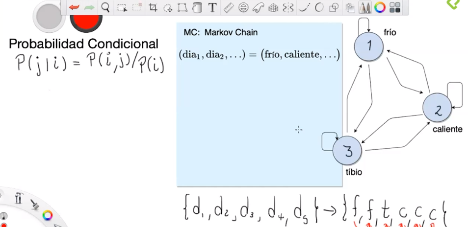

Vamos a calcular un caso particular, la transición de que yo estando en el estado 3, transiciones al estado 2

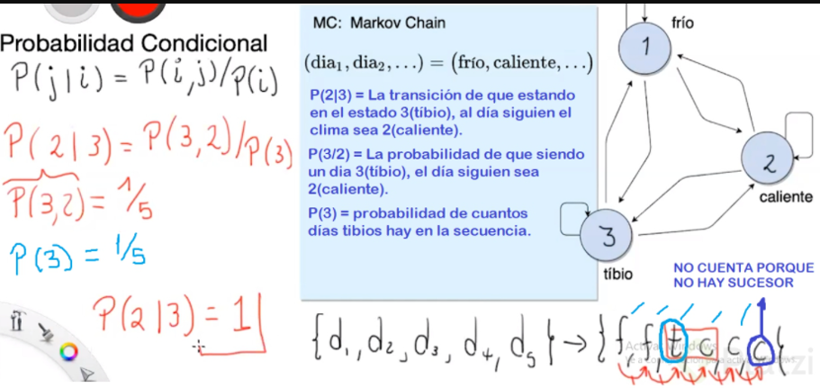

Calculamos la probabilidad del evento 2 dado 3, primero calculamos la probabilidad P(3:tibio,2:caliente), esto es la probabilidad de que transicionemos de un estado 3 a un estado 2, (contamos los eventos y tenemos solo 1 evento posible, y lo dividimos entre la cantidad de eventos totales posibles (5 eventos)).

P(3,2) = 1/5

Ahora contamos la cantidad de dias tibios en nuestros datos, y lo dividimos entre la cantidad de dias.

P(3) = 1/5

Por tanto la probabilidad P(2|3) = 1, y estará representada en la matriz con la celda C32

Ahora replicamos los pasos para construir la matriz.

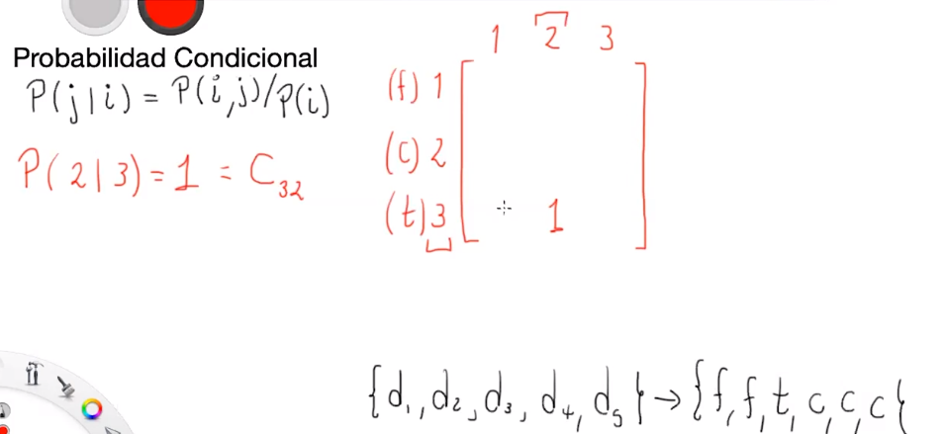

Calculamos el resto de la matriz, para realizar mis cálculos los realice a mano aunque no digitalice la hoja, doy por sentado que en la imagen la ultima  letra C  esta de más, esto porque hablamos de temperatura tomada en un espacio de 5 dias, en las llaves de temperaturas existen 6 datos por lo cual para mi fue de la siguiente manera

{d1, d2, d3, d4, d5} -> {f, f ,t ,c , c}

5 dias -> 5 mediciones de temperatura

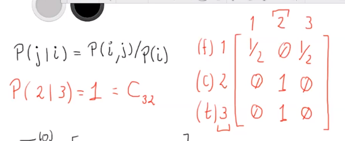

ya con la matriz de estados consideramos una distribución de estados inicial.
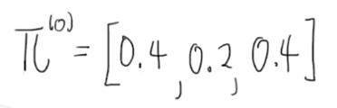

Los estados de markov se definen solo por el estado inmediatamente anterior.

Como vimos en la clase inicial al multiplicar la matriz A por el estado inicial me dará la probabilidad de ocurrencia de los estados par el dia siguiente  y obtenemos el siguiente vector PI(1)

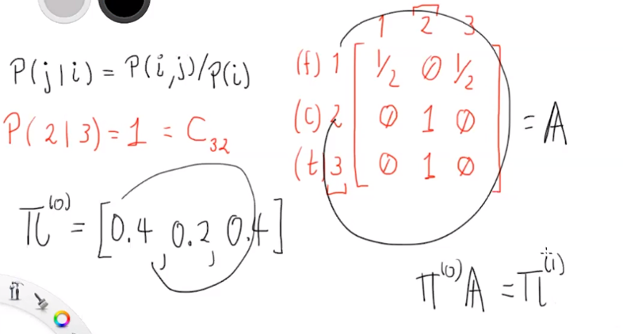

Y esta es la formula general de la Cadena de Markov.

Verificamos haciendo la multiplicación elemento a elemento.

EN general cuanto tienes estados en un tiempo t, y lo multiplicas por la matriz de estados da como resultado la probabilidad de  cada estado al dia siguiente, y esta es la **formula general de una cadena de markov**.

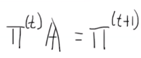

Utilizando el producto cruz (o producto punto) hacemos la multiplicación de ambas matrices y obtenemos el resultado para la probabilidad de los estados para el dia siguiente (Vector PI(1)).

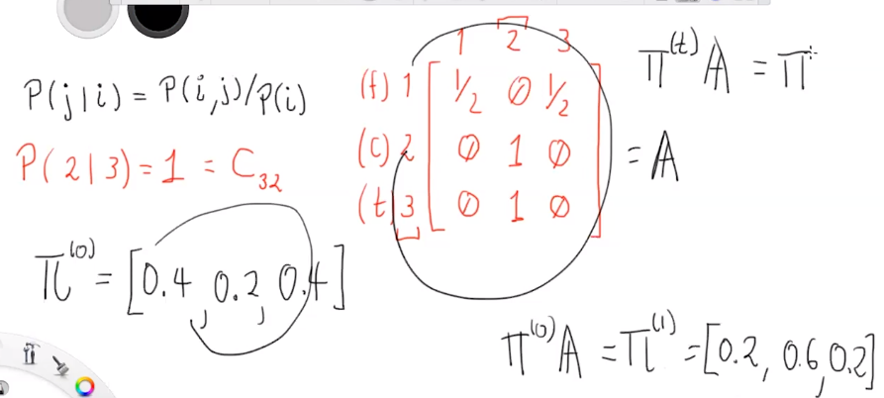

Ahora que vimos las bases de una cadena de markov y sus ingredientes esenciales veamos de manera rápida com se expande esto a una la HMM o Modelo Markoviano Latente (Hidden Markov Model).

La expansion es la siguiente, dejemos de pensar en dias, y en climas cada dia. 

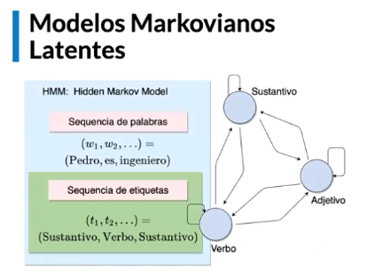

Pensemos en secuencia de palabras y secuencia de etiquetas de cada una de esas palabras.

(pedro, es, ingeniero) | (sustantivo, Verbo, Sustantivo)

Esto es una cadena latente (oculta)y el propósito del modelo es descubrir o encontrar cual es esa cadena.

### Clase 6 Entrenando un HMM

En la clase pasada vimos como funciona una cadena de markov y sus ingredientes esenciales, luego como esto se puede expandir a un modelo markoviano latente considerando una secuencia de palabras y por otro lado una cadena latente u oculto de etiquetas.

Ahora el modelo markoviano latente tiene como objetivo descubrir cual es esa cadena de etiquetas que le corresponderá a la secuencia de palabras.


La idea en un HMM es la siguiente.

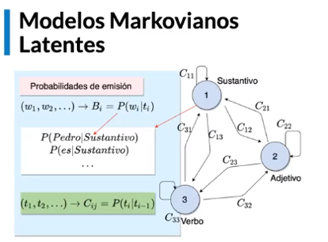

Dado que ahora tenemos tenemos una cadena de markov sobre unos estados, que aunque son latentes son estados, sobre ellos podemos definir probabilidades de transición, los cuales están en el recuadro verde Cij los cuales serán la probabilidad de cambiar de una categoría gramatical a que en la siguiente palabra haya otra categoría gramatical.

Ahora las probabilidades serán, **dada una categoría gramatical cual es la probabilidad de que esa categoría le corresponda a una cierta palabra** como en el ejemplo en el recuadro blanco.

El nodo 1 que es sustantivo puede corresponder a varias palabras, puede ser *"pedro"*, puede ser *"es"*, o en algunos casos no aplica, pero entonces  ahí las probabilidades son cero, y eso se calcula con un corpus de palabras, **esas probabilidades que son dada una categoría gramatical cual es la probabilidad de que le corresponda una cierta palabra las llamamos probabilidades de emisión** y podemos calcular un conjunto de probabilidades de emisión para cada uno de los nodos del mapa de cadena markoviana y eso junto todo corresponde  a un **modelo markoviano latente** de manera que ahora tenemos 3 ingredientes para un HMM:

- Matriz de transición
- Distribución inicial de estados
- Probabilidades de emisión.

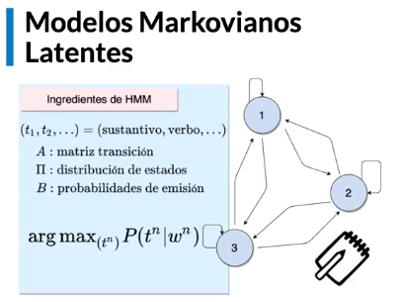

Con estos tres ingredientes el objetivo de una cadena de markov latente es encontrar **dada una secuencia de palabras cual es  la secuencia de etiquetas que le corresponde por mayor probabilidad**.

Ejercicio en el tablero.

Tenemos un modelo caracterizado por dos objetos, una matriz de transiciones (A) y otro elemento que contiene las probabilidades de emisión (B).

La entrada de un modelo serán observaciones (O), secuencias de palabras observadas (q).

Cual es la probabilidad (P) de que dada una secuencia de palabras (w^n) cual sera la probabilidad de que una secuencia de etiquetas o tags (t^n) le sea asignada, nuestro objetivo es encontrar la cantidad maxima t~^n

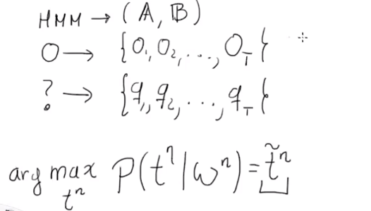

Para calcular esta probabilidad usaremos la regla de Bayes.

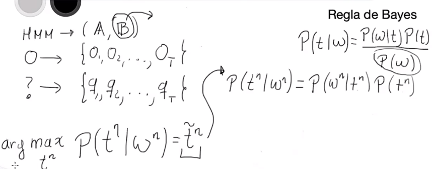

Introduciremos dos hipótesis fundamentales

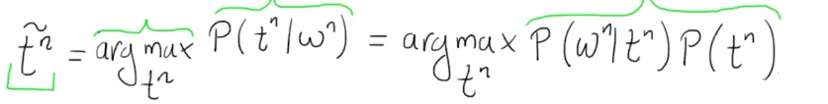

El máximo de la probabilidad a la izquierda se traduce en el producto de las dos probabilidades de la derecha, ahora es necesario introducir dos hipótesis

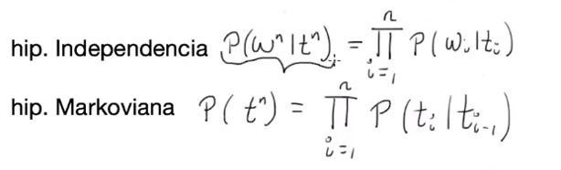

En la hipótesis Markoviana el estado actual depende del estado inmediato anterior (ejemplo del clima)

En la hipótesis de independencia, las probabilidades de palabras a etiquetas solamente dependen de la misma posición.

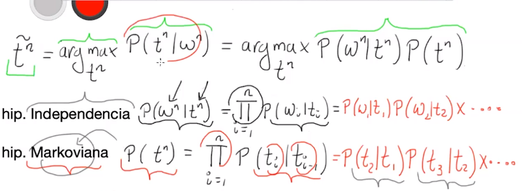

Con esto la formula que sigue un HMM es:

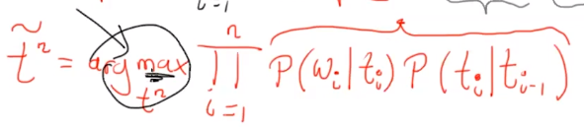

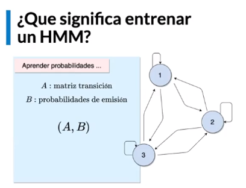

### Clase 7 Fases de entrenamiento de un HMM

Utilizaremos la siguiente [plantilla](https://colab.research.google.com/drive/1KlMtwwB439oH_133BAy4RRJzrBSiTG8Z?usp=sharing) en Google Collab para esta clase.

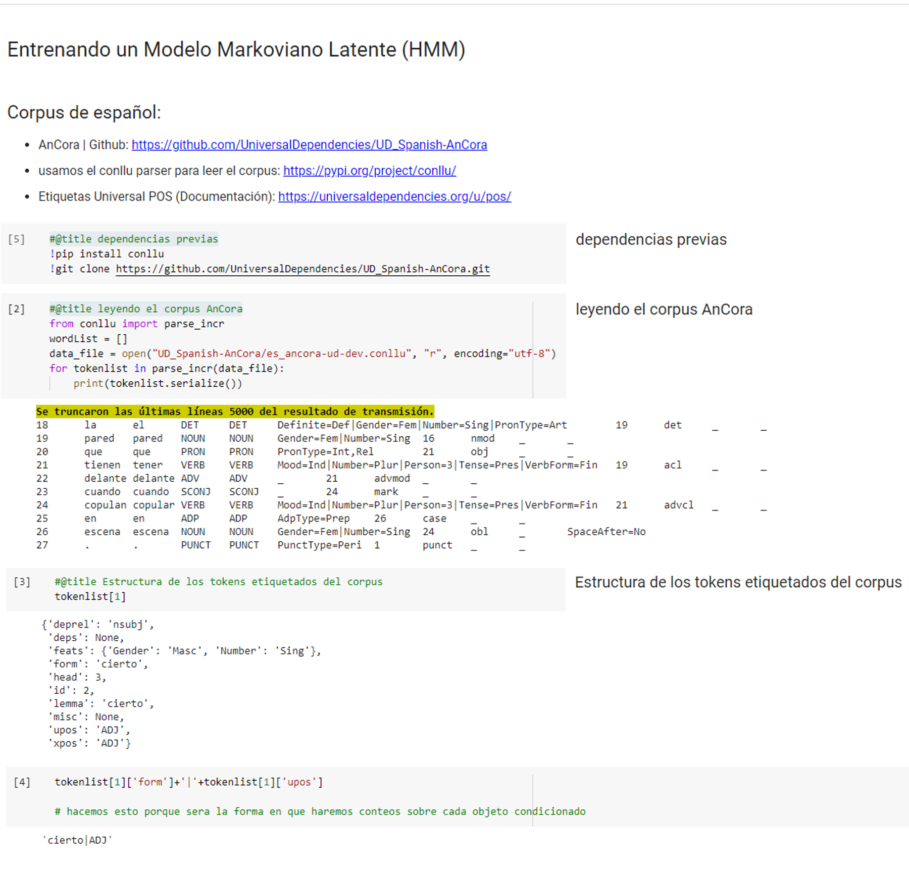

### Clase 8 Entrenando un HMM en Python

La primer etapa del entrenamiento consiste en calcular conteos.

EL primer objeto diccionario que indica cuantas veces aparece la etiqueta, el segundo objeto un diccionario que corresponde a las emisiones donde cada elemento corresponde a cuantas veces dada una etiqueta le corresponde cierta palabra, el tercero un diccionario de elementos de transiciones donde dada una etiqueta previa cuantas veces le corresponde una cierta etiqueta en la posición siguiente.

**Nota:** C() indica conteo

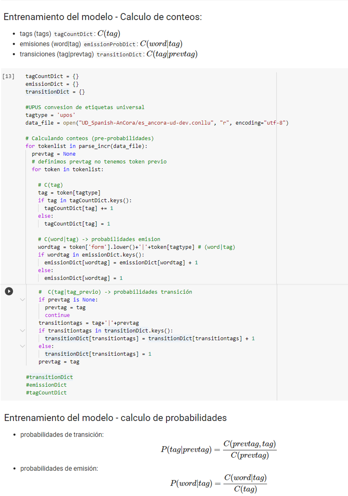

Ahora haremos el calculo de las probabilidades de transición y de emisión.

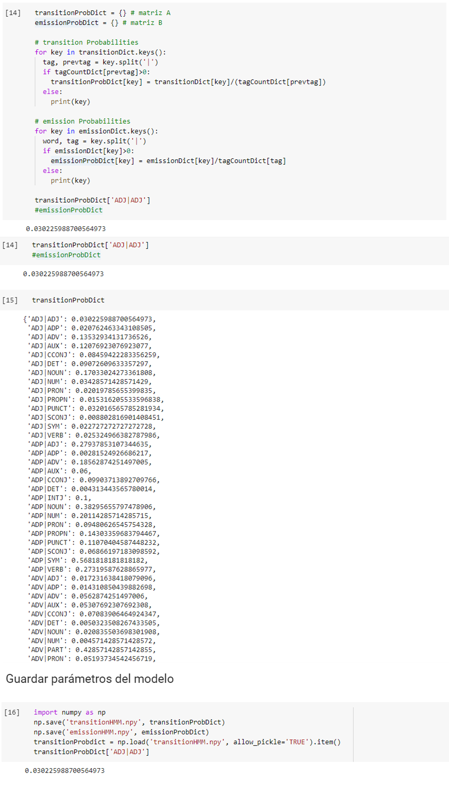

Nota: Con el breve conocimiento sobre ml, yo esperaba pasar datos a un un modelo, pero en este caso nuestro modelo es la formula adaptada, y el proceso de entrenar es obtener los diccionarios con las probabilidades, asi es como funcionan por debajo los algoritmos de ml mas sofisticados, al principio no lo entendí de esta manera y lo vi mas como recolectar datos, ojala te sirva esta experiencia, hay varias formas de entrenar modelos.

## Modulo 2 Algoritmo de Viterbi

### 9 Clase El algoritmo de Viterbi

En la clase pasada entrenamos un modelo Markoviano latente calculando las probabilidades de transición y emisión a partir de un corpus de textos en español, la idea es ahora entender como podemos usar este modelo para hacer predicciones.

La pregunta es ¿que tipo de predicciones hace un modelo markoviano latente HMM)?

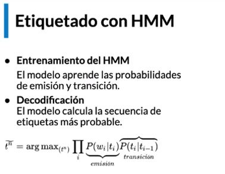

Una vez entrenado, el proceso que denominaremos **Decodificación** consiste en que dada una secuencia de palabras podamos identificar la secuencia de etiquetas gramaticales mas probable que le corresponda, y esto se hace mediante el algoritmo de **Viterbi**.

Hay otras alternativas pero primero enfoquemos en este.

La parte de entrenamiento que programamos consiste en encontrar la **matriz A** con sus **coeficientes C** y luego las **probabilidades Emisión** que son los **B** dados las probabilidades  condicionales (word | tag), luego viene el **algoritmo de Viterbi** que **se va a encargar de encontrar de entre un montón de  secuencias la secuencia mas probable** esto lo hace asignándole una probabilidad a cada secuencia que llamaremos **probabilidad de Viterbi**, luego dentro de ese espacio de probabilidades escogemos la mayor y esa seria la que el algoritmo va a retornar como la mas probable y por lo tanto la que debería ser las etiquetas correctas de la secuencia de palabras.

El algoritmo de  Viterbi funciona de la siguiente manera.

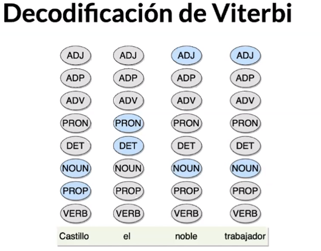

Cada columna son todas las posibles etiquetas que una palabra va a tener, castillo es una persona no un edificio un sustantivo, cada circulo corresponde a una posible categoría gramatical, los círculos en gris tienen una probabilidad cero.

¿Como esto nos ayuda a entender el algoritmo de Viterbi? de la siguiente manera.

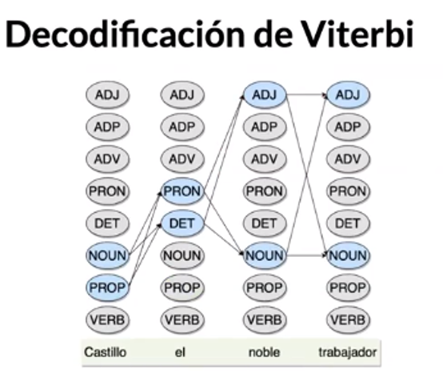

Considerando todas las posibles categorías gramaticales de cada palabra vamos creando caminos creando las etiquetas posteriores, cada camino es recorrer la primer etiqueta posible hasta la siguiente posible  y asi hasta llegar a la ultima palabra que contiene la secuencia. De todos esos caminos hay que calcular el mas probable, eso lo hacemos calculando un numero probabilistico que me diga que tan probable es que sea uno de esos caminos y escoger el mayor, eso lo hacemos de la siguiente manera.

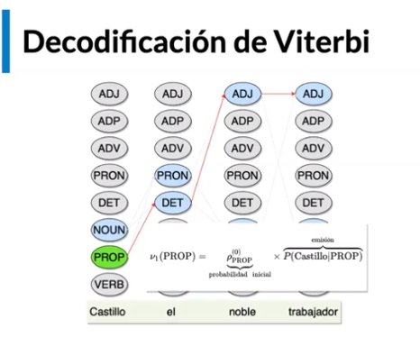

El circulo de sustantivo propio esta en color verde, significa que vamos a analizar lo que sucede en este nodo en particular, vamos a denotar con la letra griega NU, que parece una letra *V* paréntesis prop estilizada probabilidad de viterbi de que la categoría gramatical de castillo sea  "PROP" y eso es igual al "producto de la probabilidad inicial" este multiplicado por una "probabilidad condicional" de que ya que la categoría Inicial es PROP la palabra que este ubicada ahi es castillo, ese calculo lo hacemos para cada una de las celdas de esta columna, de esta manera calculamos la probabilidad de Viterbi para cada uno de los nodos de la primera columna.

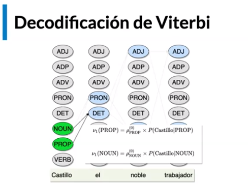

Luego vamos a la segunda columna

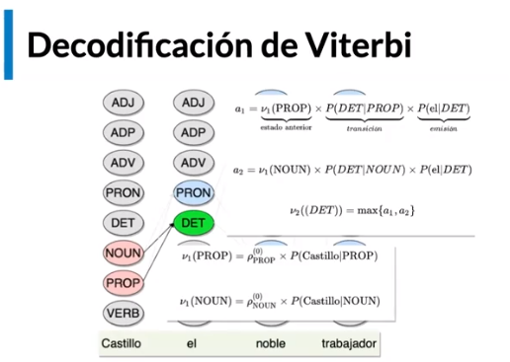

El único nodo que tiene probabilidad no nula en la segunda columna es  el de categoría determinante **(DET)**, para calcular la probabilidad de este nodo lo que vamos a hacer es considerar todos los posibles caminos que pasan por ese nodo, vemos que son dos NOUN-DET Y PROP-DET, cada uno de los números tiene una probabilidad asignada que consiste en tomar la probabilidad del estado anterior (*V1*(PROP)), multiplicar por la probabilidad condicional de la etiqueta anterior y cual sera la etiqueta siguiente que en este caso sera de que dado prop la siguiente sea *DET* y esto multiplicado por una probabilidad de emisión, que dado que la categoría es **DET** cual sera la palabra el, y que tan probable es eso, aplicamos lo mismo a otra ruta con NOUN, y de esos dos números calculamos la probabilidad y tomamos esa  como la nueva probabilidad de Viterbi del nodo que esta en verde en este momento, y asi subsecuentemente para todos los nodos en la columna, el proceso estará completo cuando hayamos calculado las probabilidades de  cada uno de los elementos de esta matriz.

### Clase 10 Calculo de las probabilidades de Viterbi

En la clase anterior vimos como funciona el algoritmo de Viterbi, este **asigna probabilidades a cada elemento en una matriz que combina filas de categorías gramaticales y columnas de palabras en una secuencia**, la idea es que con este algoritmo que con estas probabilidades el puede determinar cual es la secuencia de etiquetas mas probable para esa secuencia que nosotros le estamos dando al modelo como entrada. Veamos ahora como en profundidad son estos cálculos de probabilidades y entender la matriz mencionada.

Retomamos el ejemplo anterior donde castillo es el apellido de una persona, donde los nodos contienen las etiquetas gramaticales, pero solo los azules tienen probabilidad **no nula**, de esta manera en la primer columna solo vamos a calcular 2 probabilidades que corresponden con los nodos que indican la categoría de sustantivo (noun) o sustantivo propio (prop).

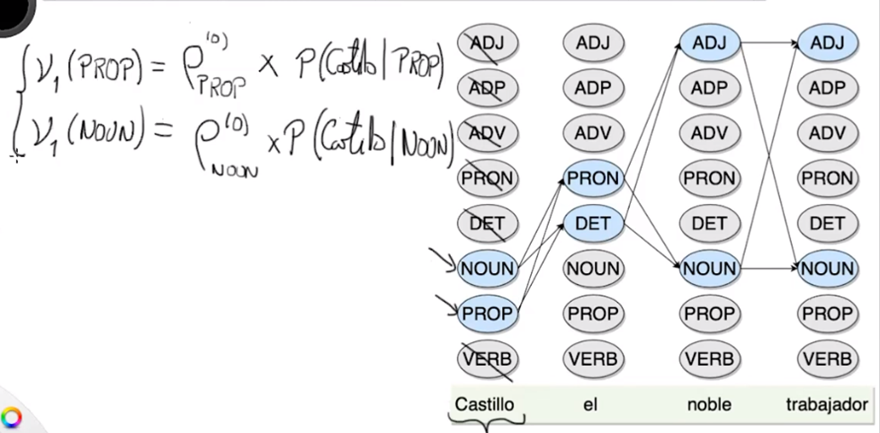

Una vez calculadas las probabilidades de cada columna, podemos empezar a visualizar la matriz, donde cada palabra de la frase sea una columna, y las filas serán las etiquetas gramaticales.

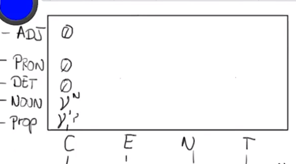

El siguiente paso es asignar las probabilidades a la columna 2 primer elemento en sus dos caminos para llegar al nodo

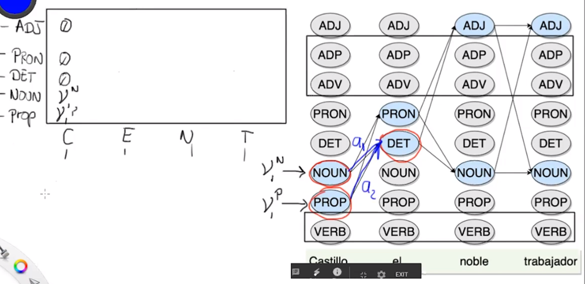

La probabilidad **a** seria igual a Probabilidad de viterbi de la etiqueta por la probabilidad de transición, por la probabilidad de emisión.

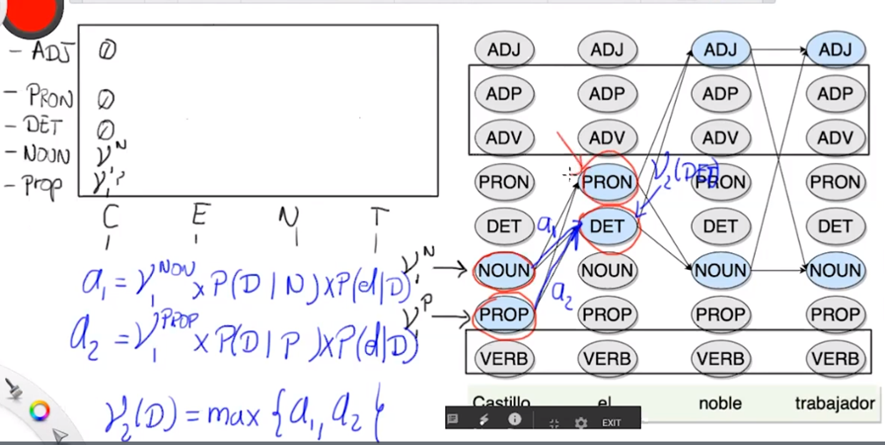

Mientras que la probabilidad de Viterbi *V2* sera la mayor entre a1 y a2, lo siguiente es aplicar el mismo concepto al nodo **PRON**, hecho esto asignamos los valores a la matriz

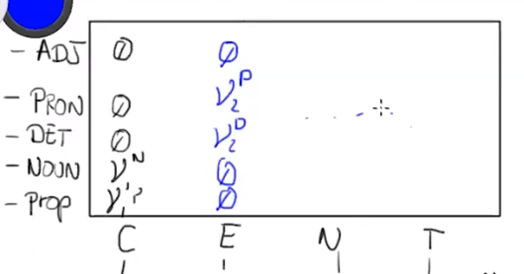

El algoritmo de viterbi termina cuando hemos calculado las probabilidades de todos los elementos de esta matriz.

En resumen el algoritmo de Viterbi mediante la búsqueda de posibles caminos de etiquetas calcula una probabilidad a cada elemento de una matriz donde esas probabilidades las llamamos probabilidades de Viterbi, el objetivo de encontrar la secuencia mas probable consiste en encontrar el camino cuyas probabilidades de Viterbi son mas grandes.

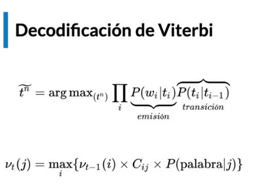

Una vez calculadas  todas las probabilidades de viterbi de todas las etiquetas posibles la matriz nos queda de la siguiente manera.

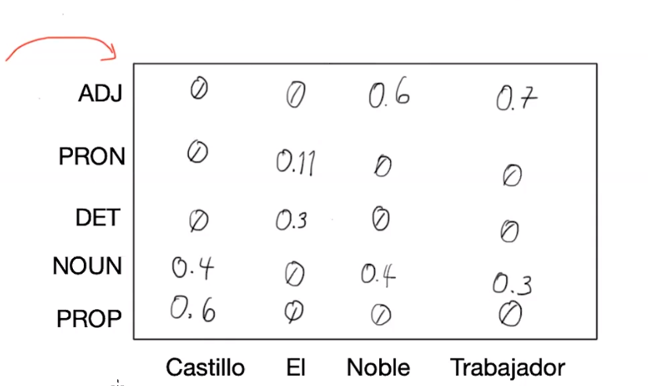

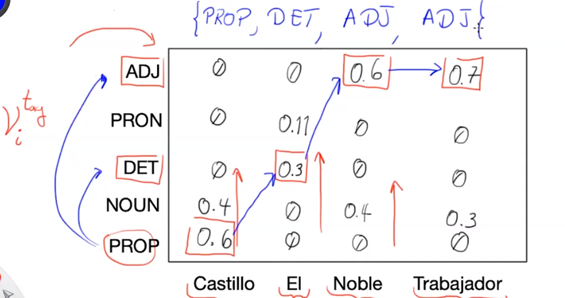

### Clase 11 Carga del modelo HMM y distribucion inicial

En la clase pasada aprendimos como funciona el algoritmo de Viterbi, la manera en que se  resuelve el problema de un Modelo de Markov Latente con este algoritmo hace referencia a un paradigma de programación llamado **Programación Dinámica** esto es cuando tu tienes un problema de optimizacion muy complejo y lo subdivides en problemas relativamente sencillos.

Utilizaremos esta [plantilla](https://colab.research.google.com/drive/1c5v1KguJNTv2cui4AOZ8lxifsdfzLspW?usp=sharing) en Collab

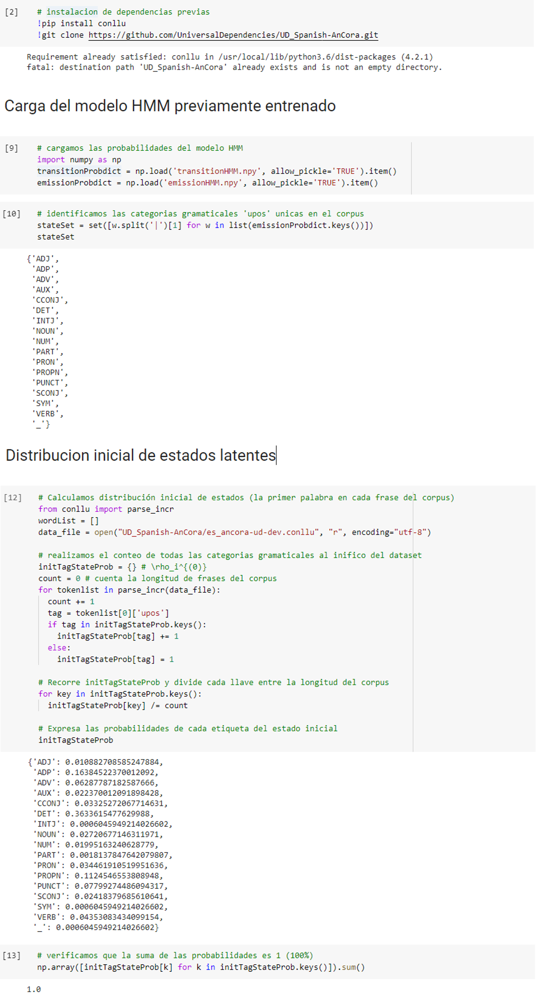

### Clase 12 Implementacion de algoritmo de Viterbi en Python

Ya tenemos todos los ingredientes preparados para construir el algoritmo de viterbi las matrices de  probabilidad, transición, emisión  las hemos cargado con el entrenamiento previo del notebook pasado y ahora preparamos la  distribucion inicial de estados, con todo esto listo el siguiente paso es construir una funcion que represente el proceso del algoritmo de Viterbi que permite buscar entre todos los caminos posibles el mas probable y por lo tanto las etiquetas mas probables.

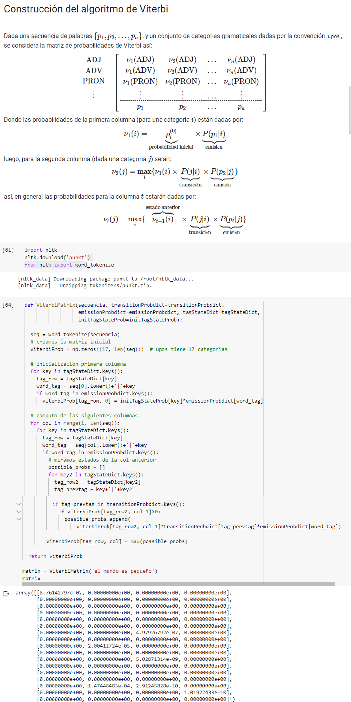

### Clase 13 Entrenamiento directo de HMM con NLTK

Esta clase cierra la primer parte del curso haciendo dos cosas, primero con la matriz de Viterbi que logramos calcular en python vamos a seleccionar la secuencia de etiquetas mas probable para  una cadena de texto, seguido usaremos NLTK y veremos que ya tiene una clase preconstruida con "buen codigo" que ejecuta el entrenamiento de un Modelo Markoviano Latente de una forma muy sencilla.

Retomando la clase anterior obteníamos la matriz de Viterbi de esta manera

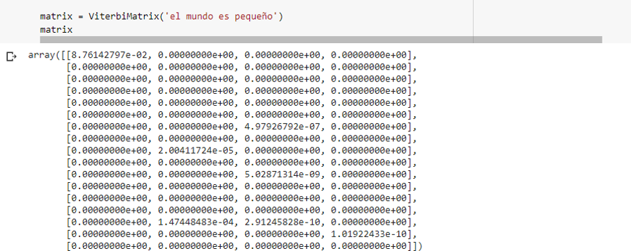

Ahora realizaremos un cambio en la funcion para obtener en lugar de la matriz las etiquetas.

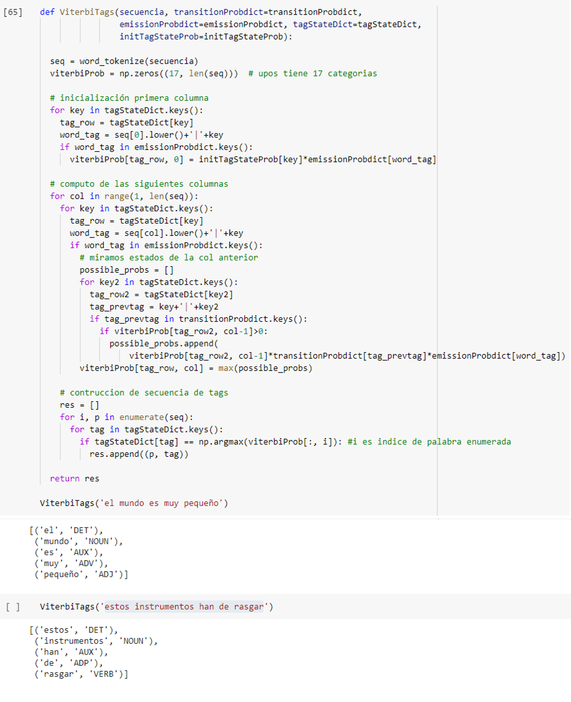

Aquí termina la parte didáctica, ahora vemos la implementacion directa de NLTK

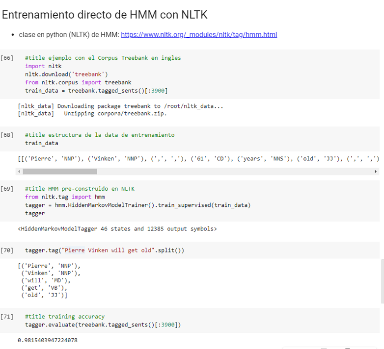

#### Reto del modulo 

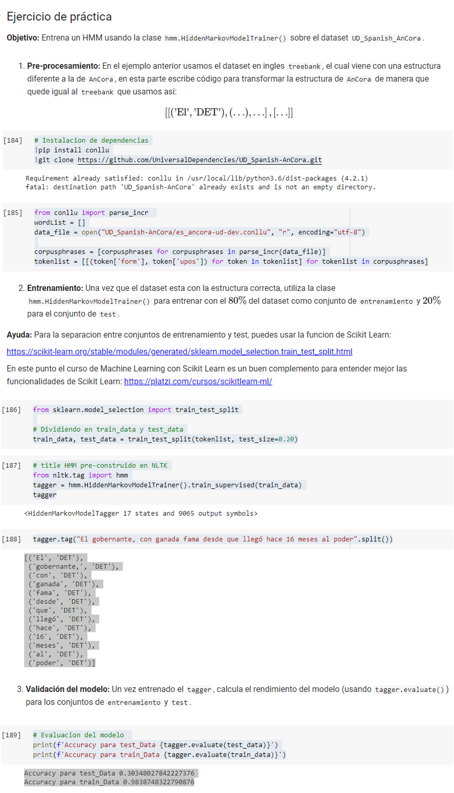

## Modulo 3 Modelos Markovianos de máxima entropía (MEMM)

### Clase 14 Modelos Markovianos de maxima entropia (MEMM)

En este punto tenemos los conocimientos suficientes para entender diversos algoritmos de clasificación, específicamente de etiquetado  que tienen cierta afinidad o similitud con los modelos  markovianos latentes, la idea de esta sección es que el profesor propone un reto en el cual tendrás que usar todo lo aprendido hasta este momento pero desarrollando codigo basado en un nuevo modelo propuesto en esta clase, derivado de los HMM.

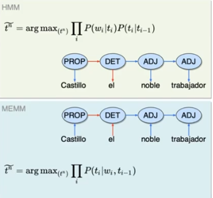

En un modelo Markoviano latente ya conocemos la formula, la secuencia mas probable de etiquetas se calcula como aquella donde dada una secuencia de palabras cual es la secuencia de etiquetas mas probable, usábamos bayes para convertir probabilidad condicional en el producto de dos probabilidades que llamábamos probabilidades de transición y  probabilidades de emisión representados con flechas rojas en HMM

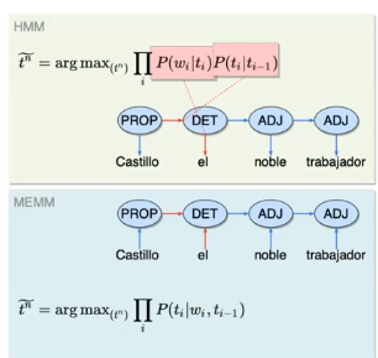

El nuevo modelo hace una diferencia, las etiquetas siguen teniendo flechas que van dirigidas desde la etiqueta anterior a la posterior, pero las flechas que conectan palabras y etiquetas van hacia arriba (de la palabra a la etiqueta).

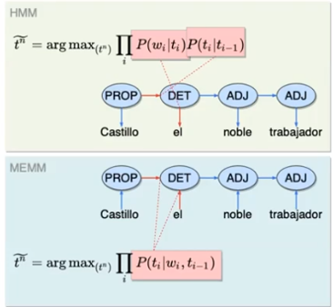

En resumen un Modelo Markoviano de Maxima Entropia se define como idéntico a HMM pero no usamos la regla de bayes para convertir esto en probabilidades de transición y emisión, sino que la probabilidad inicial es la única que vamos a  considerar directamente y vamos a crear nuevas dependencias.

En la formula inferior estamos calculando la probabilidad de que dada una palabra en la posición i, y una etiqueta en la posición i-1, cual sera la etiqueta en la posición i, sin embargo esta probabilidad no se descompone en transición - emisión como en el HMM, esta es una sutil pero gran diferencia, el performance del modelo sera distinto.

En el siguiente diagrama vemos la forma en que funciona un Modelo Markoviano de Maxima Entropia con dependencias tan arbitrarias como se desee.

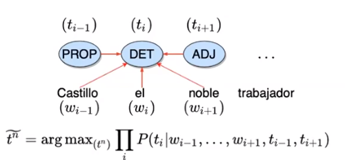

En un MEMM estamos calculando la probabilidad de que dada una palabra le corresponda una cierta etiqueta (probabilidades posteriores en bayes) y esto lo descomponíamos en la probabilidad de transición (dada una etiqueta, cual sera la que le corresponde en la siguiente posición) y la probabilidad de emisión (dada una etiqueta cual sera la palabra que el corresponda), aquí debemos pensar de forma distinta con probabilidades posteriores, la probabilidad seria la siguiente:

>Dado un contexto al rededor de una etiqueta particular que yo quiero calcular o determinar cual sera la probabilidad de que esa categoría sea un verbo/sustantivo/etc.

Esto quiere decir que tomaremos información de las etiquetas anterior y posterior con las palabras que están antes, y después, con esto caemos en el concepto de las redes neuronales donde tenemos muchas entradas y la red debe inferir una salida, haciendo uso de modelos de clasificación.

La formula nos indica que la secuencia de palabras a la cual le vamos a asignar una secuencia de etiquetas donde la probabilidad dea maxima esta dado solo por esa probabilidad, donde dada una palabra actual, palabra posterior y palabra anterior, etiqueta posterior, y etiqueta anterior quiero saber la etiqueta actual, lo cual es un contexto completo.

#### Comparacion entre modelos

CASO HMM

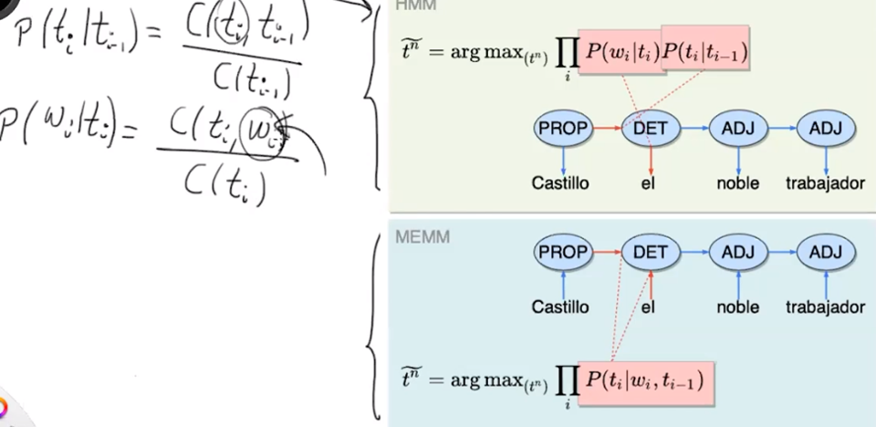

Caso MEMM

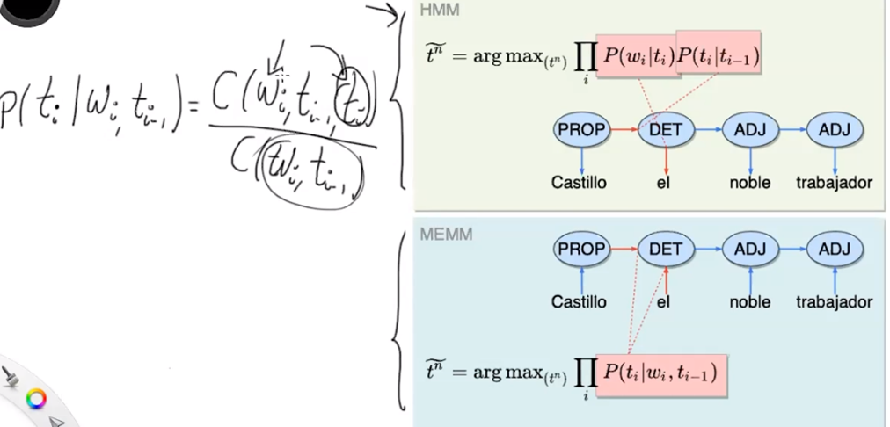

Cual es la probabilidad de que dada una palabra, y una etiqueta anterior, cual es la probabilidad de que corresponda una etiqueta en la posición actual, deberá ser un conteo donde observo la palabra y las dos etiquetas consecutivas,  dividido entre el numero de veces que veo la palabra  junto con la etiqueta en la posición inmediatamente anterior.

Esa es la forma en que deberíamos calcular matemáticamente las probabilidades para el MEMM

### Clase 15 Algoritmo de Viterbi para MEMM

En este slide vimos como construir un MEMM


Donde yo puedo predecir la categoría a la que pertenece cierta palabra considerando todo el contexto que rodea a esa categoría en términos de las categorías y palabras que se encuentran a los costados,y la palabra que corresponde a esa categoría.

Aquí el algoritmo de Viterbi se calcula con una pequeña modificación.


Teniendo en cuenta que solo calculamos probabilidades posteriores, dado un contexto de palabras y etiquetas cual  es la probabilidad de que le corresponda una cierta etiqueta. Ya no utilizamos probabilidades de transición ni emisión solo una probabilidad posterior, y el algoritmo de Viterbi tiene que adaptarse a esa filosofía, la formula debajo del slide indica como seria: "la probabilidad de Viterbi para la columna *t*  para una categoría *j* es igual al máximo de todas las posibles probabilidades donde cada una de esas probabilidades es el producto de la probabilidad de Viterbi de la columna anterior *t-1* de una categoría *i* multiplicado por la probabilidad posterior, que dado ese contexto cual debe ser la categoría *j* que debería corresponder  a la palabra.

Veamos en el tablero las diferencias de HMM y MEMM

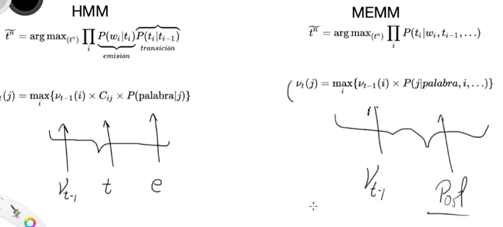

Si observas todo es muy similar al algoritmo y codigo anterior, donde eliminamos la probabilidad de transición y en lugar de la probabilidad de emisión calculamos la **probabilidad posterior de dado un contexto nos de la categoría**

### Clase 16 Reto: construye un MEMM en Python

El reto consiste en lo siguiente, escribe un codigo que te permita **entrenar** y  **decodificar** con Viterbi un MEMM.

La sugerencia es tomar el codigo anterior donde realizamos el entrenamiento y lo modifiques a conveniencia según el MEMM.

La segunda parte de decodificación por Viterbi puede ser usada como base y modificar a necesidad.

[Solucion al reto](https://colab.research.google.com/drive/1OJDUVr4LFU4FAUwOW2oJnIHo5-I-x9Nc?usp=sharing#scrollTo=6npPBeu_8OzK)

[Recursos Adicionales](https://static.platzi.com/media/public/uploads/nltk-ch06_25f69870-16c1-480a-b19f-fcb7dfc1f0f2.pdf)

[lectura recomendada](https://www.nltk.org/_modules/nltk/tag/hmm.html)

## Modulo 4 Clasificacion de texto con NLTK

### Clase 17 El problema general de la clasificación de texto

La tarea general de clasificacion en Machine learning es mas amplio que etiquetar palabras por categoría gramatical (un caso particular).

El clasificado en ML se observa en el siguiente diagrama.

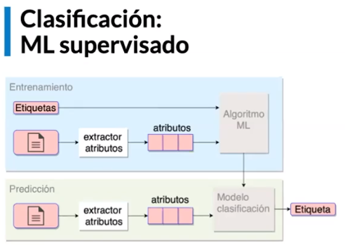

En general tu tienes un documento con texto donde extraes atributos para predecir (etiquetas) categorías de clasificacion (tema de conversación, sentimiento, prioridad,) la idea del algoritmo de IA es hacer un preprocesamiento para extraer atributos, una vez procesados y vectorizados hasta cierto punto con el algoritmo lo entrenamos para que sepa que categoría o etiquetas corresponden de acuerdos a los data points de ese conjunto o documento, el algoritmo se entrena de forma supervisada.

Una vez terminada la fase de entrenamiento sigue y tenemos formalmente un modelo de clasificacion, podemos tomar otro documento que el algoritmo no conoce y aplicamos el mismo procesamiento para atraer atributos y a partir de ellos, en teoría, si el modelo es bueno, el debe predecir la etiqueta de ese documento, de esta manera es como funciona la clasificacion en general.

#### Tecnicas de Clasificacion

Se dividen en 3 grandes categorías:

- Basadas en teoría de la probabilidad
- Basadas en teoría de la Información
- Basadas en espacios Vectoriales

#### Clasificacion de palabras

- Identificacion de genero de nombres
- Etiquetado POS (categorías gramaticales)
- Bloqueo de palabras ofensivas

#### Clasificacion de documentos

- Análisis de sentimientos
- Tópicos de conversación
- Priorización en CRMs

### Clase 18 Tareas de clasificacion con NLTK

EN la clase pasada vimos que existen dos grandes categorías para la clasificacion de texto en cuanto a la granularidad (palabras y documentos).

Para la clasificacion por palabras podemos asignar categorías, clasificarlas por genero, etiquetas gramaticales, etc.

Los documentos los clasificamos con análisis de sentimientos, respecto al tópico, o tema de conversación, o priorizacion (spam no spam).

#### Primer Ejercicio

Nuestra primer tarea sera la clasificacion de palabras para determinar el genero, para ello tomaremos esta plantilla de pseudo codigo en python

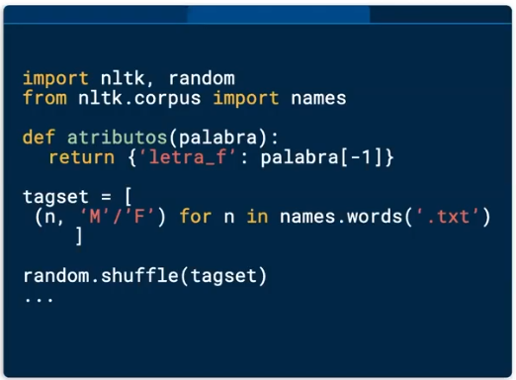

En nuestro caso definimos una funcion sencilla ya que la clasificacion de nombres sera un caso de prueba y error, nos retorna la ultima letra del nombre.

Luego de eso hacemos una lista de tuplas tomando todas las palabras de nuestro archivo de texto.

Creamos una lista random shuffle a nuestra lista para tener iguales probabilidades de que la lista tenga ambos géneros, ya que al inicio primero serán masculinos los nombres seguido de todos los nombres femeninos.

Una vez que tenemos nuestra lista de tuplas, donde cada tupla es (nombre, genero) nos damos cuenta de que el algoritmo no es el que lee directamente esos datos, el algoritmo como vimos en la clase pasada toma los atributos del texto, esto nos obliga a crear otra lista, esta sera igual en estructura pero ahora las tuplas son dos elementos donde ahora el primer elemento ya no es el nombre sino los atributos del nombre y el segundo sera el genero.

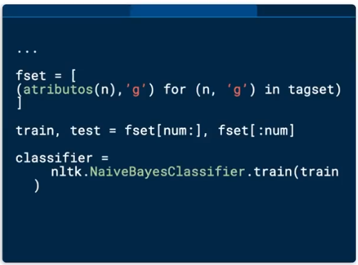

Una vez que tenemos la lista la dividimos en train y test.

Una vez tenemos los datasets crearemos una instancia de un clasificador, sin embargo nuestro clasificador al haber utilizado solo un atributo no tendrá un performance muy bueno.

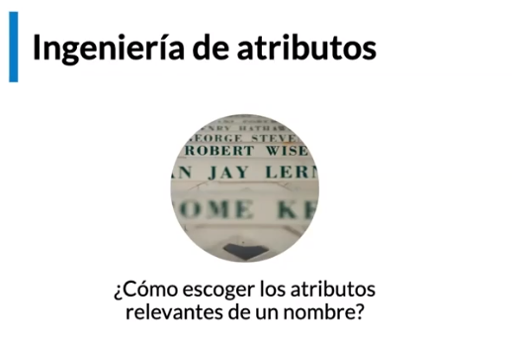

Es difícil saber a-priori saber cuales son los atributos de un objeto texto, puede ser un string muy largo que determine que esa palabra o documento caiga en una categoría especifica de manera optima para la mayoría de los casos, para todos los casos debemos utilizar prueba y error, y eso es conocido como ingeniería de atributos.

La pregunta central es como escoger los atributos mas relevantes.

El siguiente paso sera definir una nueva funcion de atributos.

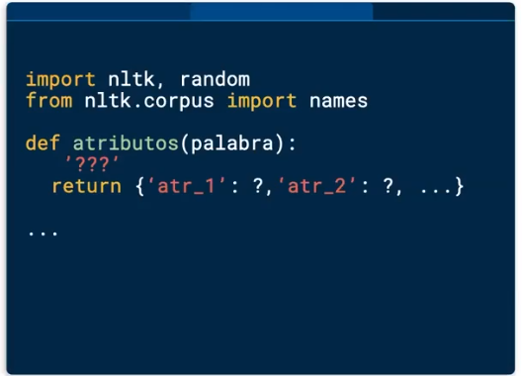

Esta funcion recibe una palabra pero aun no tenemos determinado que realizara, y el resultado sera un diccionario con n atributos para ganar mas precision.

#### Segundo Ejercicio

El segundo ejercicio sera clasificar documentos que representan emails y las categorías de clasificacion sera si el correo es spam o no lo es.

### Clase 19 Modelos de clasificacion en Python: nombres

[Aqui](https://colab.research.google.com/drive/1KnTJeBTqTLpdWpBT8PFLiOhGskBlq0fb?usp=sharing) la plantilla para nuestro ejercicio.

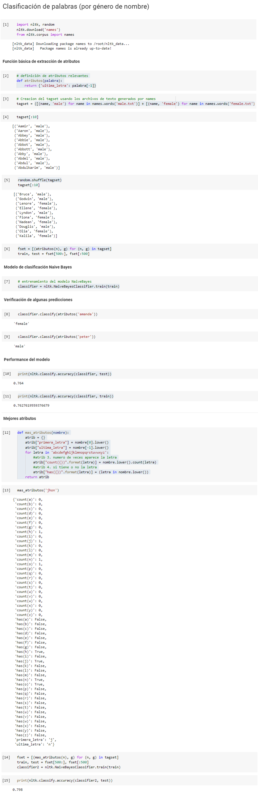

Ejercicio

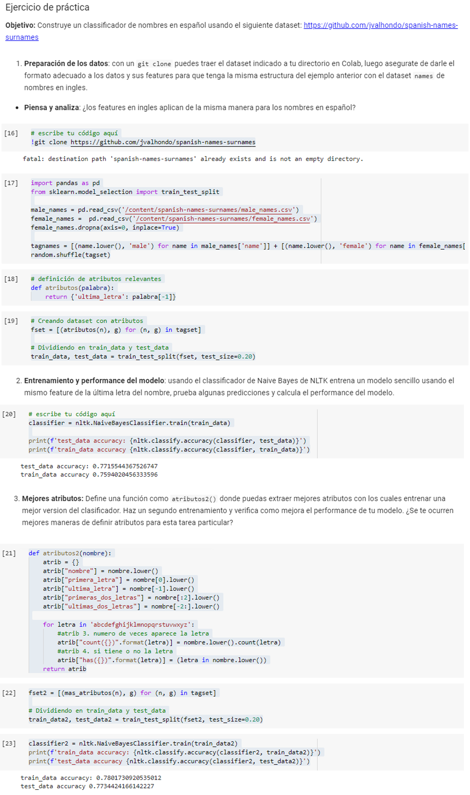

### Clase 20 Modelos de clasificacion en Python: documentos

En esta clase continuamos el ejercicio con una tarea de clasificacion de documentos, en particular vamos a escoger un dataset que representa textos en la bandeja de entrada de un email, los clasificaremos en spam o no spam.

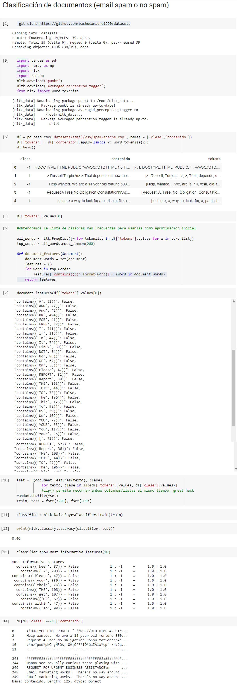

Una de las soluciones al reto de la comunidad de daniel oyama

```py
# Descomprimir ZIP
import zipfile
fantasy_zip = zipfile.ZipFile('/content/datasets/email/plaintext/corpus1.zip')
fantasy_zip.extractall('/content/datasets/email/plaintext')
fantasy_zip.close()

# Creamos un listado de los archivos dentro del Corpus1 ham/spam
from os import listdir

path_ham = "/content/datasets/email/plaintext/corpus1/ham/"
filepaths_ham = [path_ham+f for f in listdir(path_ham) if f.endswith('.txt')]

path_spam = "/content/datasets/email/plaintext/corpus1/spam/"
filepaths_spam = [path_spam+f for f in listdir(path_spam) if f.endswith('.txt')]

# Creamos la funcion para tokenizar y leer los archivos 

def abrir(texto):
  with open(texto, 'r', errors='ignore') as f2:
    data = f2.read()
    data = word_tokenize(data)
  return data

# Creamos la lista tokenizada del ham
list_ham = list(map(abrir, filepaths_ham))
# Creamos la lista tokenizada del spam
list_spam = list(map(abrir, filepaths_spam))

nltk.download('stopwords')

# Separamos las palabras mas comunes
all_words = nltk.FreqDist([w for tokenlist in list_ham+list_spam for w in tokenlist])
top_words = all_words.most_common(250)

# Agregamos Bigramas
bigram_text = nltk.Text([w for token in list_ham+list_spam for w in token])
bigrams = list(nltk.bigrams(bigram_text))
top_bigrams = (nltk.FreqDist(bigrams)).most_common(250)


def document_features(document):
    document_words = set(document)
    bigram = set(list(nltk.bigrams(nltk.Text([token for token in document]))))
    features = {}
    for word, j in top_words:
        features['contains({})'.format(word)] = (word in document_words)

    for bigrams, i in top_bigrams:
        features['contains_bigram({})'.format(bigrams)] = (bigrams in bigram)
  
    return features

# Juntamos las listas indicando si tienen palabras de las mas comunes
import random
fset_ham = [(document_features(texto), 0) for texto in list_ham]
fset_spam = [(document_features(texto), 1) for texto in list_spam]
fset = fset_spam + fset_ham[:1500]
random.shuffle(fset)

# Separamos en las listas en train y test
from sklearn.model_selection import train_test_split
fset_train, fset_test = train_test_split(fset, test_size=0.20, random_state=45)

# Entrenamos el programa
classifier = nltk.NaiveBayesClassifier.train(fset_train)

# Probamos y calificamos
classifier.classify(document_features(list_ham[34]))
print(nltk.classify.accuracy(classifier, fset_test))
```

## Modulo 6 Implementacion de un modelo de clasificacion de texto

### Clase 20 Naive Bayes

Vamos a profundizar la lógica matemática del algoritmo Naive Bayes, pero antes es necesario entender el concepto de clasificador probabilistico

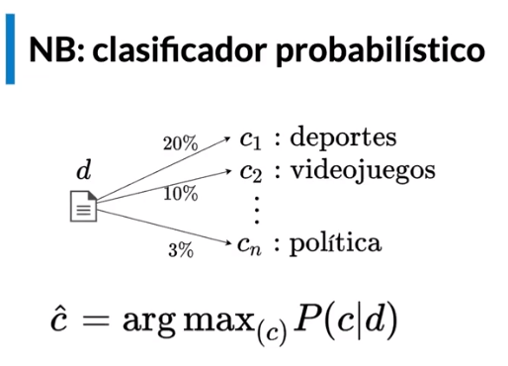

Dado un documento cualquiera el considera todas las categorías asignándoles una probabilidad, como vemos en la imagen un documento cualquiera puede estar refiriéndose a deportes, videojuegos o política, no lo sabemos, pero el modelo con la formula que observas calcula internamente una probabilidad para cada una de esas categorías, se interpreta de la siguiente manera:

La probabilidad condicional de que dado un documento "d" le corresponda una categoría "c", y al igual que con las cadenas de markov calculamos cual es la maxima de esas probabilidades, y la categoría correspondiente es la que predice el modelo porque es la que tiene la maxima probabilidad.

Por debajo, el modelo se llama Naive Bayes porque usa la regla de Bayes, con ella hace referencia a que la probabilidad llamada posterior se calcula en términos de otras probabilidades.

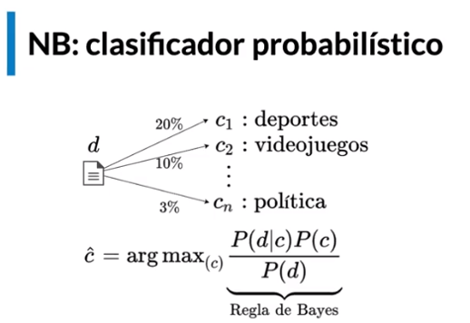

Como observamos en la imagen la idea es considerar la posibilidad de que dada una categoría "c" le corresponda un documento "d" por la probabilidad de encontrar esa categoría "c" en el corpus de datos y todo divido por la probabilidad de encontrar el documento "d" en todo el corpus de datos nuevamente.

Aquí hay un truco adicional para en vez de calcular 3 probabilidades calcular solo 2 de ellas.

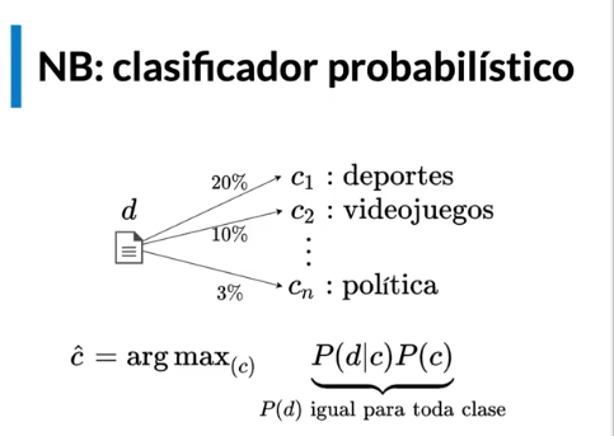

Esto porque estamos comparando el máximo de muchas probabilidades, y todas esas probabilidades están divididas por el mismo numero (la probabilidad del documento), lo único que cambia es la probabilidad de la categoría, (solo quitamos el denominador, el ams grande sigue siendo el mas grande, el mas pequeño sigue siendo el mas pequeño), y matemáticamente la **relación de orden se preserva** reduciendo esto a el calculo de solo dos probabilidades, la primera es la **Probabilidad condicional prior** en la cual dada una categoría le corresponda un documento, la segunda es **probabilidad de encontrar esa categoría en el corpus de datos**, el problema de Naive Bayes se reduce a eso, ahora veamos como se desglosa.

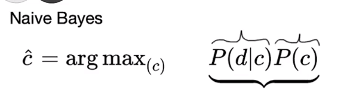

La probabilidad como vimos tenemos  el producto de una distribucion de probabilidad condicional, por el producto de una probabilidad  sobre las categorías, la idea es encontrar la categoría donde su probabilidad es maxima, la pregunta a responder es como calcular esas probabilidades

Primero encontrar la probabilidad de que dada una categoría le corresponda un documento,  y luego la probabilidad de encontrar la categoría en el corpus

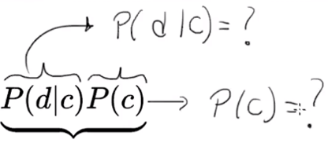

La primera categoría es esta condicional, un documento estará compuesto por un conjunto de features "fn", estos serán atributos.

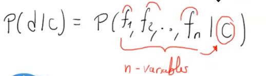

Vamos a usar la **"hipótesis de Naive Bayes"** que consiste en decir que existe cierta independencia en  la probabilidad conjunta, diciendo que en realidad el factor se puede reducir al producto de varias probabilidades.

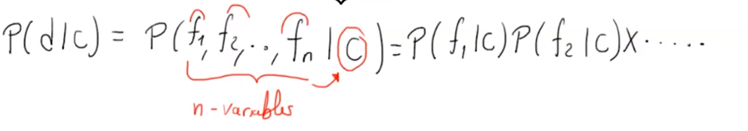

Asi tomaremos el valor máximo de esa serie de cálculos de probabilidades, y ello lo podemos expresar con la siguiente formula utilizando PI mayúscula para denotar al conjunto de productos de probabilidad.

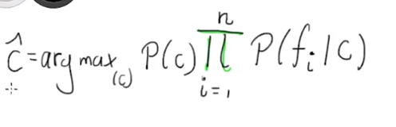

Sin embargo aun hay que tomar en cuenta un factor adicional, el elemento PI Mayúscula (productoria en matemáticas) puede significar que estamos multiplicando demasiados elementos, esto porque el numero de features *n* puede ser muy grande, y si nuestras probabilidades son números relativamente pequeños por ejemploÑ

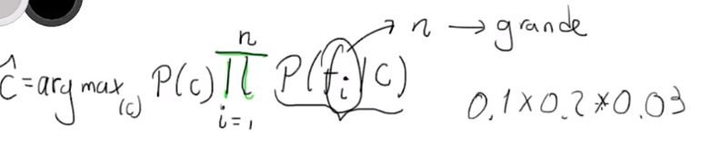

En general cuando multiplicas números menores a la unidad el numero resultante sera cada vez mas pequeño, computacionalmente no es bueno ya que la maquina puede llegar a interpretar estos números como un cero, para evitar utilizamos el truco del logaritmo.

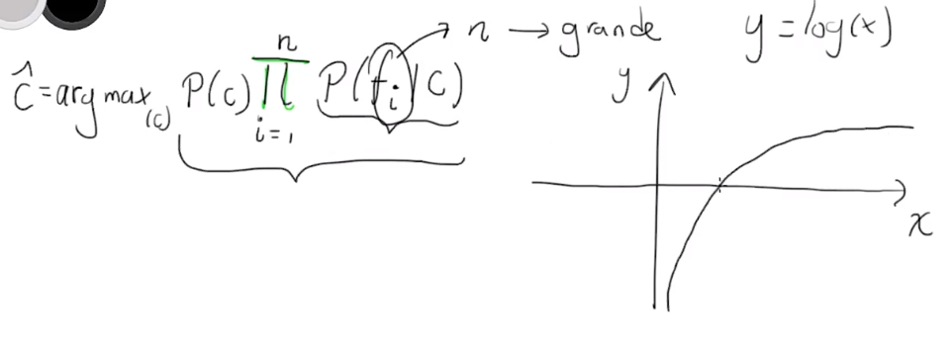

Recuerda que en la funcion logaritmo los números cercanos a cero para y serán números negativos

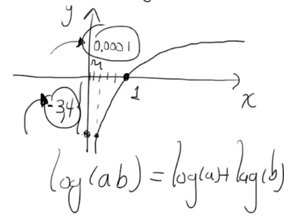

Y que tambien los logaritmos tienen propiedades. De esta forma la formula se convierte en lo siguiente.


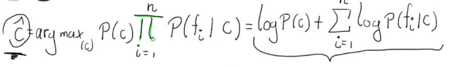

Con la ultima expresión evitamos el fenómeno de underflow que es cuando sobrepasamos la precision de la maquina utilizando números cada vez mas pequeños.

Solo nos falta recordar que cada una de estas propiedades se calcula haciendo conteos sobre el dataset como en los modelos anterior.

### Clase 22 Naive Bayes en Python: preparacion de los datos

En esta clase vamos a implementar Naive Bayes, descarga [aquí](https://colab.research.google.com/drive/1PqnvqGWqb7wO74bDt8LcjILF6N1pbeMe?usp=sharing) la plantilla de collab

En esta parte del ejercicio descargamos los corpus, hacemos unzip a los folders que los contienen y utilizamos os.listdir() como un input en ciclos  for para leer todos los archivos.txt y hacer append al texto para conformar nuestros dataset base.

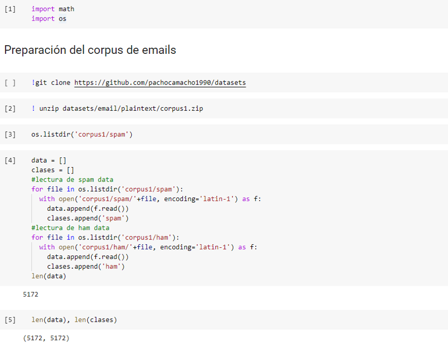

### Clase 23 Naive Bayes en Python: construcción del modelo

Antes de continuar con el notebook hay que recordar la sutileza del algoritmo de Naive Bayes, y es que debemos multiplicar muchas probabilidades, y si estas son tan pequeñas la precision de maquina nos dará como resultado cero, el truco es pasarse a un espacio logarítmico, esta sera la formula que vamos a implementar en la clase.

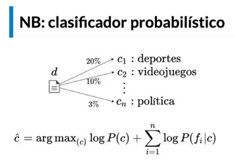

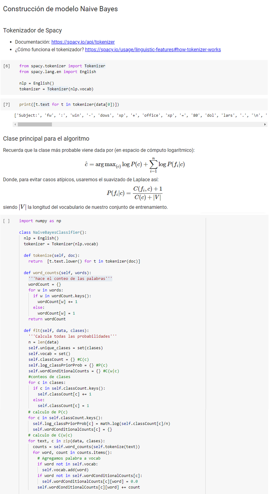


### Clase 24 Naive Bayes en Python: ejecución del modelo

En esta clase desarrollaremos el método predict de la clase que permitirá hacer predicciones cuando el modelo ya esta entrenado.

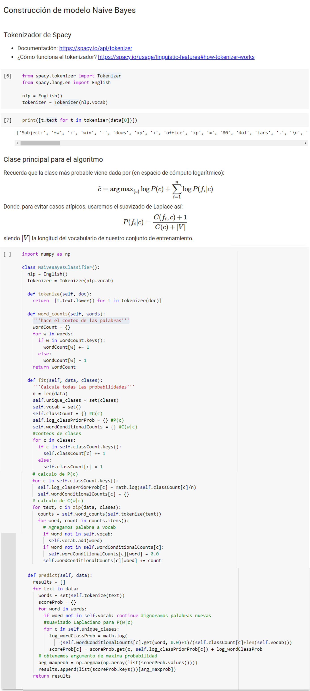

Realizamos el procesamiento de los datasets para obtener los sets de entrenamiento y test, posterior probamos por primera vez nuestro modelo, lo entrenamos y obtenemos el accuracy del mismo respecto a los datos clases_test vs clases_predict

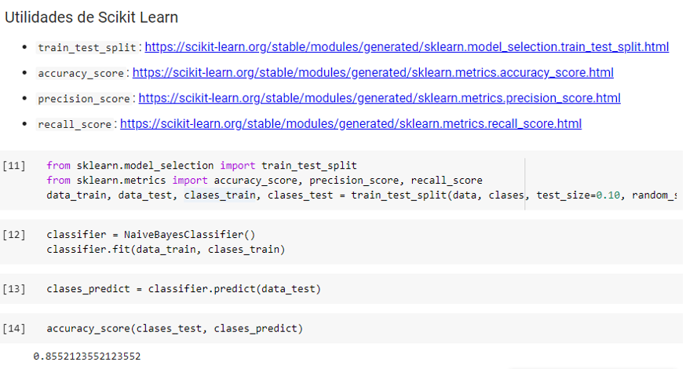

### Clase 25 Metricas para algoritmos de clasificacion

En nuestra clase pasada logramos algo espectacular, desarrollamos un modelo a partir de sus formulas matemáticas en python que nos permite entrenar ese modelo y luego usarlo para hacer predicciones.

En esta clase existen otras metricas para que uno pueda analizar mejor las predicciones de un algoritmo.

La métrica mas estándar en un modelo de clasificacion es el accuracy

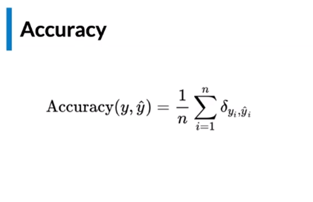

Es simplemente la proporción entre el numero de predicciones que fueron correctas y el numero total de predicciones que fueron realizadas, el accuracy máximo es 1, cuando ambos números son iguales.

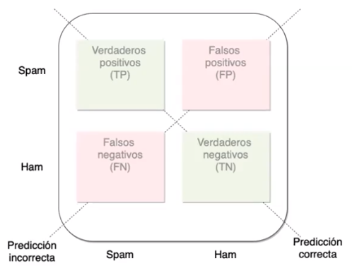

En verde tenemos la suma de los verdaderos positivos y los verdaderos negativos, es decir correos que eran spam o ham clasificados correctamente.

Otra métrica es la **Precision**

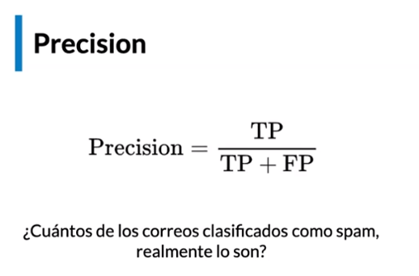

Nos responde basicamente lo siguiente, cuando estoy clasificando correos como spam mi modelo arroja un cierto numero de correos diciendo esto es spam, pero en la realidad solo una fracción de predicciones son verdaderas, y la métrica precision nos dice eso.


El **Recall**

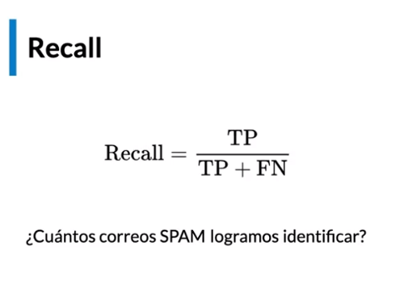

Básicamente dice, en la vida real  este conjunto de datos es spam, pero de esa realidad usted solo logro identificar una fracción.

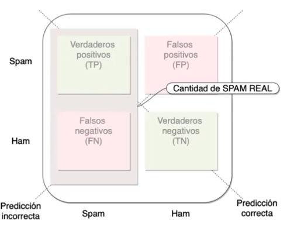

En la tabla lo vemos como lo que era spam, y la fracción que yo logre capturar como spam.

Entonces como te das cuenta son 3 metricas diferentes, calcularemos esto en el notebook.

### Clase 26 Reto final: construye un modelo de sentimientos

Advertencia, puedes remitirte a la documentación de NLTK donde hay una sección  que habla específicamente de clasificacion de texto con un bloque como ves en el slide

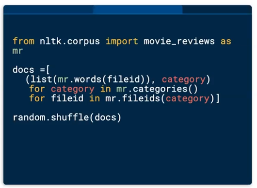

Trabajan con un review de película, la idea es que realices algo similar a lo aprendido en clase.

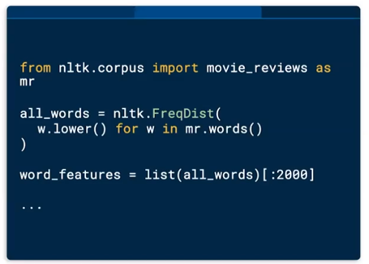

Y a partir de ahi crees las features para el modelo de sentimiento.

Una propuesta es usar el modelo de Amazon


Donde tenemos una base para construir una análisis de sentimiento con base de 1 a 5, el dataset necesita que hagas procesamiento, posterior a ello debes utilizar un modelo.

[Aquí](https://colab.research.google.com/drive/1CkX_FFEdmpsavhoJi2vYXZAvVLaRNBZd?usp=sharing) la solución del profesor

Mejora tus habilidades creando mas proyectos.